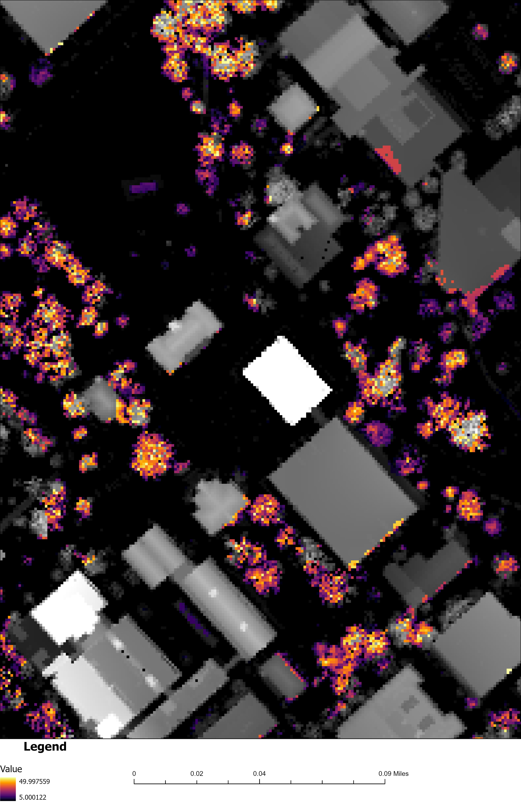

# Hello trees

A map made from lidar derived surface elevations and made in ArcGIS Pro Spring 2025

* Data from kyraster.ky.gov
* NDVI greater than 0.1 values to find vegitation
* Heights greater than 5 feet and less than 50 feet

## KY Tree Canopy Model

*Download[Tree Canopy Model UKY Campus](tree_canopy.pdf)*
